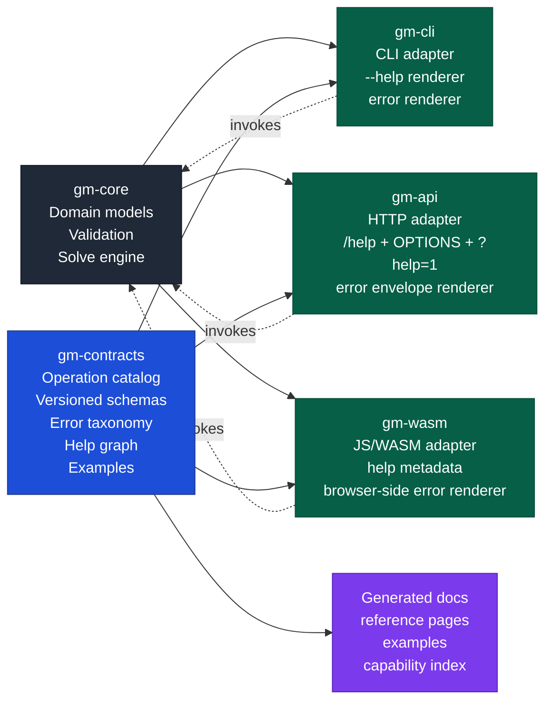

# Agent Interface Architecture

This document describes how GroupMixer should adopt the **agent-first static discovery** principle across:

- `gm-cli`
- `gm-api`
- `gm-wasm`

without duplicating semantics, help text, schemas, or error behavior.

The key doctrine is:

> The surface is static. The caller is intelligent.
>
> Bootstrap narrowly, discover recursively, and let every affordance describe itself.

## Goal

All public solver interfaces should expose the **same capability graph** and the
same semantic truth:

- same operation names
- same request/response concepts
- same versioned schemas
- same error taxonomy
- same recovery guidance
- same related-affordance links
- same examples

But each interface should still feel native to its transport:

- CLI uses `--help`
- HTTP uses `GET /help`, `OPTIONS`, or `?help=1`
- WASM/JS uses `help()` / metadata accessors

The system should avoid three bad outcomes:

1. duplicated help text drifting between surfaces
2. duplicated schema definitions drifting between surfaces
3. duplicated error semantics drifting between surfaces

## Architectural direction

Keep `gm-core` as the authoritative domain and execution layer.
Do **not** push CLI, HTTP, or JS transport semantics into it.

Instead, introduce a **shared interface-contract layer** as a peer to the
transport adapters.

Recommended name:

- `gm-contracts`

This crate becomes the single source of truth for the agent-usable interface
model.

## Sequencing: contracts first, package restructure second

Do the **contracts extraction first**.

Why:

- it proves the semantic boundary before introducing filesystem churn
- it avoids mixing naming/package moves with meaning changes in one step
- it lets `gm-cli`, `gm-api`, and `gm-wasm` converge on one
  contract model while paths are still familiar
- it makes the later package move largely mechanical

Recommended order:

1. introduce `gm-contracts` in the current workspace layout
2. migrate shared operation/schema/error/help truth into it
3. make CLI/server/WASM consume it
4. generate reference docs from it
5. only then consider a workspace reshape such as:

```text
backend/
  core/
  contracts/
  cli/
  api/
  wasm/
```

If the repo is later reorganized, renaming `gm-api` to `api` is a good
fit because it describes the role more clearly.

## Proposed structure



## Responsibilities by layer

### 1. `gm-core`

Owns:

- domain models
- validation rules
- solve behavior
- feasibility logic
- scoring logic
- result generation

Must **not** own:

- transport-specific help text
- CLI flag documentation
- HTTP route wording
- JS-specific docstrings
- per-surface error formatting

`gm-core` remains the engine, not the operator-facing affordance catalog.

### 2. `gm-contracts`

This is the crucial new layer.

It should own the canonical definition of:

- public operations/capabilities
- operation IDs
- operation categories
- versioned input schemas
- versioned output schemas
- error codes and error kinds
- recovery hints
- related operations
- examples
- bootstrap metadata
- progressive-discovery links

Think of it as a **static affordance graph** plus renderable metadata.

Implementation-wise, this should be a small Rust crate with explicit metadata
registries, not a giant handwritten docs bundle and not an HTTP-first spec.

Recommended building blocks:

- `serde` for transport-neutral request/response/help/error structures
- `schemars` for deriving JSON Schema from Rust public DTOs
- optional `thiserror` for internal typed errors
- optional `miette` for richer CLI rendering
- optional `ts-rs` or `typeshare` if TS type generation becomes useful
- optional `utoipa` only as an exported HTTP projection, not as the semantic
  source of truth

Important rule:

> OpenAPI may be generated from the contracts, but it should not define the
> contracts.

The source of truth should be:

1. public Rust DTOs
2. explicit operation/error/example/help metadata registries
3. generated schemas and docs

Example conceptual contents:

- `types.rs`
- `capability_catalog.rs`
- `schemas.rs`
- `errors.rs`
- `examples.rs`
- `bootstrap.rs`
- `render/{cli,http,js,docs}.rs`

This layer should be descriptive, not transport-bound.

### 3. `gm-cli`

Should become a thin CLI projection of the shared contracts.

It should:

- register commands/subcommands from the contract catalog
- render `--help` from shared metadata
- validate arguments against shared contract definitions
- map internal failures onto shared error codes
- print related commands/help pointers from shared metadata

It should **not** hand-author a separate semantic manual if the information is
already present in the contracts layer.

### 4. `gm-api`

Should become a thin HTTP projection of the same shared contracts.

It should expose:

- a minimal bootstrap endpoint
- top-level capability listing
- per-endpoint help
- schema endpoints if needed
- stable error envelopes
- links to related endpoints

Examples:

- `GET /help`
- `GET /solve?help=1`
- `OPTIONS /solve`
- `GET /schemas/solve-request`

These are not separate semantics; they are HTTP renderings of the same catalog.

### 5. `gm-wasm`

Should become a thin JS/WASM projection of the same shared contracts.

It should expose browser-local discoverability such as:

- `groupmixer.help()`
- `groupmixer.help("solve")`
- `groupmixer.capabilities()`
- `groupmixer.schema("solve-request")`

The WASM layer should not invent a browser-only semantic model. It should reuse
exactly the same contract graph and error taxonomy as CLI and HTTP.

### 6. Generated docs

Markdown reference docs should be **generated from the contracts layer**, not
maintained as a separate semantic source of truth.

Human-written conceptual docs may still exist, but reference material for:

- operations
- schemas
- errors
- examples
- related affordances

should derive from the shared catalog.

## What must be single-source-of-truth

The following should each have exactly one authoritative home:

### Operation identity

Examples:

- `solve`
- `validate-scenario`
- `inspect-result`
- `list-constraints`

Each operation should have:

- stable ID
- summary
- category
- mutability class (`read`, `write`, `compute`, `inspect`)
- related operations

### Schemas

Input/output shapes should be declared once and reused across:

- CLI validation/help
- server help and error reporting
- wasm metadata/help
- generated docs

Preferred implementation:

- define public DTOs in Rust
- derive `Serialize`, `Deserialize`, and `JsonSchema`
- register them under stable schema IDs and versions

If `gm-core` types are not a good public boundary, define public DTOs in
`gm-contracts` and convert at the edges.

### Errors

Error semantics should be declared once.

Each error definition should include:

- stable code
- human summary
- machine category
- affected field/path if applicable
- valid alternatives if applicable
- recovery text
- related help target(s)

Errors should be canonicalized once and then projected natively:

- CLI renders readable diagnostics
- HTTP renders structured JSON envelopes
- WASM renders JS-friendly error objects

The wording style may vary by transport, but the code, meaning, recovery, and
related-help targets should stay identical.

### Examples

Examples should be declared once and projected into:

- CLI help examples
- HTTP help examples
- WASM examples
- docs pages

## Progressive discovery model

Every surface should implement the same discovery pattern.

### Bootstrap

Bootstrap should reveal only top-level affordances.

Examples:

- CLI: `gm-cli --help`
- HTTP: `GET /help`
- WASM: `groupmixer.help()`

Bootstrap should answer:

- what major operations exist
- how to ask each one for more help
- which operation families are related

### Local help

Every operation should expose local help.

Examples:

- CLI: `gm-cli solve --help`
- HTTP: `GET /solve?help=1`
- WASM: `groupmixer.help("solve")`

Local help should answer only for that operation:

- what it does
- required inputs
- optional inputs
- output shape summary
- error families
- related operations
- concrete examples

### Recursive traversal

Every help response should point to adjacent affordances.

Examples:

- `solve` points to `validate-scenario`, `inspect-result`, `list-constraints`
- `inspect-result` points to `solve` and result-schema help
- `validate-scenario` points to relevant schema help and constraint inspection

This is the anti-duplication mechanism at the interface level:

> no surface has to ship one giant full manual, because the shared contract
> graph allows incremental traversal.

## Error architecture

Errors are not an afterthought. They are part of the affordance graph.

Every surface should use the same canonical error definitions and then render
those in transport-native form.

### Canonical error shape

Conceptually:

- `code`
- `message`
- `where`
- `why`
- `valid_alternatives`
- `recovery`
- `related_help`

### Projection examples

#### CLI

```text
error[unknown-constraint]: unsupported constraint kind "ShouldBeTogether"
where: constraints[2].kind
why: the solver only supports RepeatEncounter, AttributeBalance, MustStayTogether, ShouldStayTogether, ShouldNotBeTogether, ImmovablePerson, ImmovablePeople, PairMeetingCount
how_to_fix: replace the kind or consult the constraint catalog
see: gm-cli list-constraints --help
```

#### HTTP

```json
{
  "error": {
    "code": "unknown-constraint",
    "message": "unsupported constraint kind 'ShouldBeTogether'",
    "where": "constraints[2].kind",
    "why": "the solver only supports known constraint kinds",
    "valid_alternatives": [
      "RepeatEncounter",
      "AttributeBalance",
      "MustStayTogether",
      "ShouldStayTogether",
      "ShouldNotBeTogether",
      "ImmovablePerson",
      "ImmovablePeople",
      "PairMeetingCount"
    ],
    "recovery": "replace the kind or inspect the constraint catalog",
    "related_help": ["GET /constraints?help=1"]
  }
}
```

#### WASM

```ts
{
  code: "unknown-constraint",
  message: "unsupported constraint kind 'ShouldBeTogether'",
  where: "constraints[2].kind",
  recovery: "replace the kind or call groupmixer.help('constraints')",
  relatedHelp: ["constraints"]
}
```

## Why this avoids semantic duplication

This architecture avoids semantic duplication because the transports do not own
meaning. They only own rendering and invocation.

### Shared once

Define once in `gm-contracts`:

- operation graph
- schemas
- error taxonomy
- examples
- related-help edges

### Project many times

Render many times in:

- `gm-cli`
- `gm-api`
- `gm-wasm`
- generated docs

### Keep transport-specific code thin

Each transport layer should only own:

- argument/route/binding wiring
- native presentation details
- conversion to/from the canonical contract model
- conversion to/from `gm-core`

## Recommended dependency direction

```text
gm-core                  # engine and domain truth
gm-contracts             # public affordance + schema + error truth
gm-cli                   # CLI projection of contracts + core
gm-api                # HTTP projection of contracts + core
gm-wasm                  # JS/WASM projection of contracts + core
```

Recommended rule:

- `gm-core` should not depend on transport crates
- transport crates should not define competing semantic contracts
- docs should not be the semantic source of truth when a contract can be generated

## Suggested rollout order

### Phase 1 — Define the shared contracts layer

Introduce the shared crate and move into it:

- operation catalog
- schema metadata
- error codes
- related-help graph
- example registry
- public DTOs and schema derivation plumbing

Use this phase to prove the shape of the contract model before moving packages
around.

### Phase 2 — Make `gm-cli` the first consumer

Use CLI as the proving ground for:

- bootstrap help
- local per-command help
- consistent errors
- related-command guidance

### Phase 3 — Project the same model into `gm-api`

Expose the same affordances over HTTP with:

- bootstrap endpoint
- local endpoint help
- schema exposure
- stable error envelopes

### Phase 4 — Project the same model into `gm-wasm`

Expose browser-local help/capabilities APIs from the same registry.

#### Concrete WASM rollout plan

The `gm-wasm` projection should be implemented in five explicit steps so the
browser surface stays thin and contract-driven:

1. **Inventory and binding table**
   - enumerate exported WASM affordances
   - map public solver-facing exports onto stable `gm-contracts`
     operation IDs
   - mark legacy/support-only exports as explicitly out of scope rather than
     letting them silently masquerade as contract surfaces
2. **Bootstrap + local help + schema accessors**
   - expose a minimal browser-local bootstrap surface such as capabilities/help
   - expose local help for one operation at a time
   - expose schema listing and schema lookup by stable schema ID
3. **Canonical JS-facing errors**
   - stop relying on ad hoc thrown strings for public solver-facing failures
   - project failures into the shared `PublicErrorEnvelope`/`PublicError`
     semantics, rendered in a JS-friendly shape
4. **Recursive related-help navigation**
   - ensure operation help and public errors include exact related help targets
     that a browser caller can follow locally
   - keep this transport-native by using operation IDs and WASM help accessors,
     not generic external-doc pointers
5. **Parity tests**
   - add wasm/unit tests that fail when exported operation IDs, schema IDs,
     error codes, or related-help edges drift from `gm-contracts`

The intended public/browser-local discovery surface is:

- bootstrap: `capabilities()`
- local help: `get_operation_help(operation_id)`
- schema list: `list_schemas()`
- schema lookup: `get_schema(schema_id)`
- error list: `list_public_errors()`
- error lookup: `get_public_error(error_code)`

The intended public/browser-local execution surface is:

- `solve(request)`
- `solve_with_progress(request, progress_callback?)`
- `validate_scenario(request)`
- `get_default_solver_configuration()`
- `recommend_settings(recommend_settings_request)`
- `evaluate_input(request)`
- `inspect_result(result)`

Legacy JSON-string compatibility exports, if they remain temporarily, should be
explicitly named as support-only shims such as:

- `solve_legacy_json(...)`
- `solve_with_progress_legacy_json(...)`
- `validate_scenario_legacy_json(...)`
- `get_default_settings_legacy_json()`
- `get_recommended_settings_legacy_json(...)`
- `evaluate_input_legacy_json(...)`

These should be exported as thin JS/WASM projections of `gm-contracts`, not
as a second handwritten semantic registry.

### Phase 5 — Generate reference docs

Generate Markdown or JSON reference output from the same contract layer.

#### Concrete docs/parity rollout plan

Once CLI, server, and WASM consume `gm-contracts`, the repo should add a
single derived-reference workflow with three parts:

1. **Generate deterministic reference artifacts**
   - materialize operations, schemas, errors, and examples into a stable docs
     location under `docs/reference/generated/gm-contracts/`
   - generate both review-friendly Markdown and machine-readable JSON index
     artifacts
2. **Add stale-output guardrails**
   - provide one repo command that regenerates the artifacts
   - provide one repo command that fails if checked-in generated outputs are
     stale or missing
3. **Add cross-surface parity checks**
   - compare `gm-contracts` against the public projections in:
     - `gm-cli`
     - `gm-api`
     - `gm-wasm`
   - prove parity for operation IDs, schema IDs, error codes, and related-help
     targets where representable

Contributor workflow should be explicit:

1. change `gm-contracts`
2. update transport projections (`gm-cli`, `gm-api`, `gm-wasm`)
3. regenerate derived reference artifacts
4. run parity/freshness checks

If a semantic change skips step 1, that change is architecturally backwards.

### Phase 6 — Optional package restructure

After the contracts layer is working and adopted by all three interfaces,
consider a workspace reshape to reduce naming noise:

```text
backend/
  core/
  contracts/
  cli/
  api/
  wasm/
```

This should be treated as a mechanical cleanup after the semantic architecture
has stabilized, not as the first move.

## Design rules

1. **Do not duplicate semantic help by surface.**
2. **Do not let CLI, server, and WASM invent different names for the same operation.**
3. **Do not let errors drift by transport.**
4. **Do not require a giant manual to use the system.**
5. **Make every operation self-describing and connected to related operations.**
6. **Keep the receiver static; let the caller do the planning.**
7. **Generate reference docs from the contract layer whenever possible.**

## Current contributor workflow

This architecture is now meant to be followed operationally, not just
conceptually.

When changing a public solver-facing semantic fact, contributors should use the
following order:

1. update `gm-contracts`
2. update the relevant projection(s):
   - `gm-cli`
   - `gm-api`
   - `gm-wasm`
3. regenerate `docs/reference/generated/gm-contracts/`
4. run contract freshness and parity checks

Primary local commands:

```bash
./tools/contracts_reference.sh generate
./tools/contracts_reference.sh check
cargo test -p gm-contracts
cargo test -p gm-cli
cargo test -p gm-api -- --nocapture
cargo test -p gm-wasm
```

See `docs/CONTRACTS_WORKFLOW.md` for the concrete contributor workflow.

## Bottom line

The elegant architecture is:

- `gm-core` stays the engine
- a new shared contract layer defines the public affordance graph once
- `gm-cli`, `gm-api`, and `gm-wasm` become thin projections of that graph
- generated docs derive from the same source

That gives GroupMixer:

- agent-first progressive discovery
- consistent semantics across all interfaces
- minimal semantic duplication
- transport-native UX
- and a maintainable single source of truth
