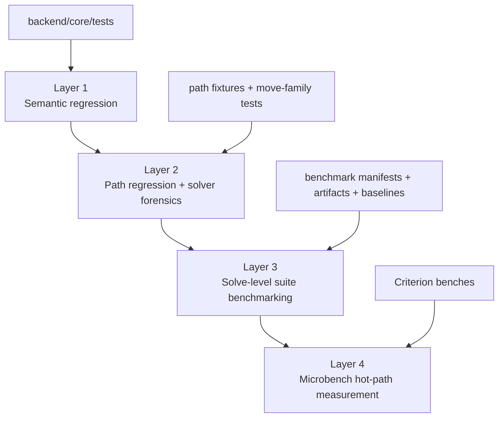
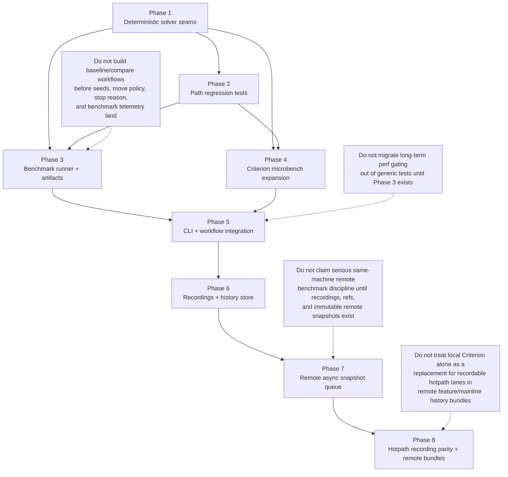

# Solver Benchmarking Architecture

## Status

Partially implemented architecture.

Waves 1-5 of the local benchmark stack are now in place:

- deterministic solver seams
- path-regression safety
- solve-level benchmark artifacts/baselines/comparisons
- Criterion microbench expansion
- local CLI/workflow/storage integration

This document now also defines the **next operational expansion**: a remote,
same-machine benchmark queue built around immutable repo snapshots, durable
recordings, machine-lane refs, and mirrored artifacts.

## Why this document exists

The solver needs a benchmarking system that is strong enough to support architectural refactoring without losing either:

- semantic correctness
- hot-path performance
- visibility into *why* a regression happened

This architecture was informed by an earlier snapshot/recording benchmark
workflow used in another repo, but that external system is only historical
inspiration.

For GroupMixer, the normative sources are this document and the repo-local
materials under `benchmarking/` plus the implementation in
`solver-benchmarking/`.

The goal is not to "simplify" the operational model away. GroupMixer still
wants a remote snapshot/recording/queue system adapted to **GroupMixer's**
solver surfaces, doctrine, and test strategy.

This document is the architectural reference for that adaptation.

---

## Architectural intent

The benchmark system is **not** a thin wrapper around `cargo bench`.

It is a deliberately layered safety and forensics system whose jobs are:

1. prove solver refactors did not change semantics unexpectedly
2. prove performance did not regress on representative workloads
3. explain regressions by move family and code path
4. force clearer solver boundaries so the later refactor improves the repo instead of hiding more logic inside a monolith

That means the benchmark system is both:

- a **testing architecture**
- a **refactoring forcing function**

---

## Current state in this repo

Today the repo has the local benchmark architecture in place, but it does not
yet have the full remote benchmark operations layer.

### Existing strengths

- `backend/core/tests/data_driven_tests.rs`
  - strong end-to-end fixture harness
  - already the main solver integration contract
- `backend/core/tests/property_tests.rs`
  - invariant coverage
- `backend/core/src/solver/tests.rs`
  - local state/scoring tests
- `backend/core/benches/solver_perf.rs`
  - Criterion smoke performance coverage
- `solver-benchmarking/`
  - suite manifests
  - schema-versioned run/baseline/comparison artifacts
  - comparison summaries and explicit comparability reporting
- `solver-cli benchmark ...`
  - run / compare / baseline save / baseline list commands
- `benchmarking/WORKFLOW.md`
  - local workflow and CI lane guidance

### Current gaps

- there is no durable benchmark **recording store** with history, refs, and indexed machine-lane queries
- there is no async **remote snapshot queue** for reproducible remote benchmark execution
- there is no remote machine workflow for `snapshot`, `record-main`, and `record-feature` style operations
- there is no mirrored remote artifact lane under local repo storage
- there are no recordable **hotpath benchmark artifacts** equivalent to the remote hotpath lanes used in the reference repo
- Criterion remains local and cargo-driven, which is valuable, but does not by itself provide remote queued history lanes

So the repo currently has:

- a real local benchmark architecture
- no first-class remote benchmark operations system yet

---

## Design principles

This design follows the repo doctrine in `docs/reference/principles/AGENTIC_ENGINEERING_PRINCIPLES.md` and the testing policy in `docs/TESTING_STRATEGY.md`.

### 1. Benchmarking is a first-class engineering surface

The benchmark system must be designed as architecture, not as a pile of scripts.

### 2. Separate semantic correctness from runtime comparison

A test that proves correctness is not automatically a useful performance artifact.
A runtime measurement is not automatically a trustworthy semantic regression test.

Both matter. They should be linked, but not collapsed into one layer.

### 3. Determinism first

If we cannot reproduce a run honestly, we cannot compare it honestly.

### 4. Root-cause telemetry, not just scorecards

The system must explain:

- which move family regressed
- whether initialization changed
- whether preview or apply got slower
- whether acceptance behavior changed
- whether path fanout widened

### 5. Representative cases drive architecture

Representative workloads should drive hot-path decisions.
Stretch and adversarial cases remain important, but they should not drown out the common path.

### 6. Keep the solver core explicit

The benchmark system should push the solver toward explicit seams:

- seed control
- move policy
- stop reason
- telemetry sink
- observer/reporting boundary

That is useful benchmarking architecture and good repo architecture.

---

## The 4-layer benchmark architecture

The right shape for this repo is **four distinct layers**.



## Layer 1 — Semantic regression surface

### Purpose

Prove refactor safety.

### Primary location

- `backend/core/tests/`
- `backend/core/src/solver/tests.rs`
- property tests and focused integration tests

### What it should prove

- score bookkeeping remains correct
- constraints still mean the same thing
- invalid inputs still fail explicitly
- schedules remain structurally valid
- delta/apply logic stays semantically correct

### What it should *not* try to do

- be the main performance comparison layer
- act as the long-term runtime baseline system

### Role in the architecture

This is the semantic floor. No performance work matters if this layer is weak.

---

## Layer 2 — Path regression and solver forensics surface

### Purpose

Prove that every move family and important solver code path is both:

- exercised intentionally
- semantically correct
- measurable in isolation

### Primary location

New tests and fixtures in:

- `backend/core/tests/move_*.rs`
- `backend/core/tests/search_driver_regression.rs`
- `backend/core/tests/construction_regression.rs`
- `benchmarking/cases/path/`
- `benchmarking/path-matrix.yaml`

### What it should prove

- swap delta/apply correctness
- transfer delta/apply correctness
- clique-swap delta/apply correctness
- construction correctness and determinism
- stop-condition behavior
- reheating behavior
- session restriction behavior
- explicit activation of move-family-specific paths

### Why this layer matters

Without this layer, the larger benchmark suite can only say:

- runtime changed
- score changed

It cannot say:

- swap preview slowed
- transfer apply drifted
- clique swaps widened the touched state
- reheating changed search behavior

This layer is the bridge between semantic tests and benchmark forensics.

---

## Layer 3 — Solve-level benchmark suite

### Purpose

Compare real solver runs across representative, stretch, and adversarial workloads.

### Primary location

A new dedicated surface:

```text
benchmarking/
solver-benchmarking/
```

### What it should do

- load benchmark manifests
- execute suites deterministically
- emit machine-readable artifacts
- save named baselines
- compare current vs baseline
- generate concise human summaries

### Why this should be separate from `backend/core/benches/`

Criterion is excellent for repeated microbench timing.
It is not the right primary home for:

- case manifests
- multi-case reports
- baselines
- comparison reports
- class rollups
- same-machine benchmarking workflows

So the solve-level benchmark system should be its own architectural surface.

---

## Layer 4 — Microbench surface

### Purpose

Measure hot-path kernels repeatedly with Criterion.

### Primary location

- `backend/core/benches/`

### What it should cover

- construction/init
- swap preview
- swap apply
- transfer preview
- transfer apply
- clique swap preview
- clique swap apply
- full score recalculation
- maybe cost-component helpers if a local hotspot warrants it

### Role in the architecture

Criterion remains important, but as the **microbench layer**, not as the entire benchmark architecture.

---

## Repository layout target

## New documentation and spec surface

```text
benchmarking/
  README.md
  SPEC.md
  SCHEMAS.md
  TOOLING.md
  path-matrix.yaml
  suites/
    path.yaml
    representative.yaml
    stretch.yaml
    adversarial.yaml
  cases/
    path/
    representative/
    stretch/
    adversarial/
  schemas/
    case-run.schema.json
    run-report.schema.json
    baseline-snapshot.schema.json
    comparison-report.schema.json
```

## New implementation surface

```text
solver-benchmarking/
  Cargo.toml
  src/
    lib.rs
    manifest.rs
    runner.rs
    report.rs
    compare.rs
    artifacts.rs
    summary.rs
    machine.rs
```

## Existing surfaces that remain important

```text
backend/core/tests/
backend/core/benches/
backend/cli/
```

---

## Required solver seams before the benchmark system is credible

The benchmark architecture depends on four explicit solver capabilities.

## 1. Seed control

### Why

The benchmark system cannot be trusted if the solver run is not reproducible.

### Required change

Add explicit seed support in the solver configuration.

### Architectural effect

The seed must drive:

- random initialization in `backend/core/src/solver/construction.rs`
- move selection in `backend/core/src/algorithms/simulated_annealing.rs`
- acceptance RNG in the same search loop

### Desired shape

A single source of truth in the solver config, for example:

- `seed: Option<u64>`

This should be honored everywhere randomness exists.

---

## 2. Move policy control

### Why

The user wants detailed regression tests for every move type and solver code path.
That cannot be honest if move-family selection remains purely implicit and probabilistic.

### Required change

Add explicit move-family policy controls.

### The benchmark system needs to be able to say

- run normal mixed policy
- run swap-only
- run transfer-only
- run clique-swap-only
- bias move-family weights for a diagnostic case

### Desired shape

Something like:

- allowed move families
- optional weights per family
- optional force-single-family mode for path tests

### Architectural effect

This turns move-family selection from hidden search behavior into an explicit control surface.
That is good architecture independently of benchmarking.

---

## 3. Explicit stop reason

### Why

Comparison artifacts need to report *why* the solver stopped.

### Required change

Add a stable stop-reason enum.

### Examples

- `max_iterations`
- `time_limit`
- `no_improvement`
- `progress_callback_stop`

### Architectural effect

Removes guesswork from benchmark reports and from future operator-facing surfaces.

---

## 4. Benchmark telemetry / observer surface

### Why

Current `ProgressUpdate` is useful, but it is primarily UI/progress oriented.
The benchmark system needs a forensics-oriented telemetry model.

### Required change

Add a dedicated telemetry/observer boundary that can collect benchmark data without conflating it with human logs.

### The benchmark system needs to observe

- initialization timing
- search timing
- finalization timing
- iterations completed
- move-family attempts/accepts/rejects
- preview/apply timings by move family
- score improvement metrics
- reheats performed
- optional recalculation counts

### Architectural effect

Introduces a thin truthful instrumentation layer instead of embedding benchmark semantics inside stdout logs or ad hoc callbacks.

---

## Semantic regression structure

The benchmark architecture depends on better solver regression structure.

## Existing end-to-end fixtures stay

The current fixture harness in:

- `backend/core/tests/data_driven_tests.rs`
- `backend/core/tests/test_cases/*.json`

should remain the main integration contract for solver behavior.

That is already aligned with repo guidance.

## New focused regression files should be added

Suggested additions:

```text
backend/core/tests/move_swap_regression.rs
backend/core/tests/move_transfer_regression.rs
backend/core/tests/move_clique_swap_regression.rs
backend/core/tests/search_driver_regression.rs
backend/core/tests/construction_regression.rs
```

These tests should be deterministic and narrow enough to prove exact behavior around a targeted path.

---

## Move-family regression design

Each move family should get both:

1. **delta correctness tests**
2. **apply correctness tests**

### Standard assertion pattern

For a deterministic state:

1. compute `calculate_*_cost_delta`
2. clone the state
3. apply the move on the clone
4. fully recalculate scores/caches
5. compare:
   - expected delta vs actual score change
   - cached counters vs recalculated counters
   - structural invariants

### Shared assertions

Every move-family suite should repeatedly check:

- no duplicate assignments
- capacity respected
- participation respected
- constraint caches consistent
- cost after apply is consistent with full recalculation

---

## Path matrix

The benchmark system should maintain a path matrix as an explicit artifact.

Suggested location:

- `benchmarking/path-matrix.yaml`

### Purpose

Track which cases intentionally cover which paths.

### Example categories

#### Swap

- same-group no-op
- non-participant rejection
- forbidden-pair delta path
- should-together delta path
- attribute-balance delta path
- pair-meeting delta path
- apply path cache consistency

#### Transfer

- target-full rejection
- source-singleton rejection
- clique-member rejection
- immovable rejection
- attribute-balance delta path
- pair-meeting delta path
- apply path cache consistency

#### Clique swap

- inactive-session rejection
- partial-participation handling
- immovable clique-member rejection
- immovable target-member rejection
- accepted clique-swap full recalculation consistency

#### Search driver

- allowed-sessions enforcement
- cycle reheating
- no-improvement reheating
- time-limit stop
- no-improvement stop
- callback early stop
- mixed vs forced move policy

#### Construction

- seeded random init determinism
- warm-start preservation
- immovable placement
- clique placement
- partial attendance placement

This matrix gives the repo an explicit statement of benchmark/test coverage over architectural paths.

---

## Benchmark suite taxonomy

The suite system should classify every case into one primary class.

## 1. Path

Small deterministic cases that intentionally activate specific move families or solver branches.

Use for:

- path coverage
- move-family regression safety
- targeted diagnostics

## 2. Representative

Realistic common workloads.

Use for:

- day-to-day performance regression checks
- hot-path architecture decisions
- baseline comparison for normal solver behavior

## 3. Stretch

Larger or more expensive workloads.

Use for:

- scalability diagnosis
- controlled stress analysis
- performance planning

## 4. Adversarial

Constraint-heavy, awkward, or boundary-shaped workloads.

Use for:

- rejection honesty
- robustness analysis
- unsupported-shape or edge-behavior visibility

### Rule

Reports and comparisons must preserve suite class.
Representative cases should not be drowned out inside one giant mixed average.

---

## Benchmark artifacts

The benchmark architecture needs four machine-readable artifact kinds.

## 1. Case run artifact

One case executed once under one specific solver configuration.

### Minimum fields

- schema version
- case id
- case class
- fixture path
- commit identity
- machine identity
- effective seed
- effective budget
- effective move policy
- stop reason
- status
- runtime
- initial score
- final score
- best score
- iteration count
- per-move-family counters
- timing breakdown

## 2. Run report

A collection of case run artifacts from one suite execution.

### Minimum fields

- schema version
- suite metadata
- run metadata
- case list
- totals
- class rollups

## 3. Baseline snapshot

A named frozen run report intended for future comparisons.

### Purpose

Support the refactor workflow:

1. record baseline
2. refactor
3. rerun suite
4. compare
5. understand deltas honestly

## 4. Comparison report

A structured diff between a current run and a baseline snapshot.

### Minimum capabilities

- comparability status
- per-case runtime deltas
- per-case quality deltas
- per-move-family deltas
- class rollup deltas
- regression suspect summary

---

## Timing and telemetry model

The benchmark system should capture timing in a way that aligns with the solver architecture.

## Solve-level timing buckets

Recommended buckets:

- initialization / construction
- search loop total
- finalization / result extraction
- total runtime

## Search-level timing buckets

Recommended buckets:

- move selection
- preview / delta evaluation
- acceptance decision
- apply / commit
- explicit full recalculation count and time where applicable

## Per-move-family telemetry

For each move family:

- attempts
- accepts
- rejects
- accept rate
- preview count
- preview time total
- preview time average
- apply count
- apply time total
- average delta of accepted moves
- total improvement contributed
- optional rejection categories where meaningful

This is the minimum level needed for real forensics.

---

## Human-readable benchmark output

Structured JSON artifacts are the source of truth.

Human-readable summaries should be generated from them.

### Summary sections should include

- run overview
- representative / stretch / adversarial rollups
- biggest regressions
- biggest improvements
- move-family suspect list
- comparison conclusion

The human summary should explain the machine data, not replace it.

---

## Same-machine comparison policy

Runtime comparisons are only honest when machine identity is tracked.

Benchmark artifacts should record at least:

- machine hostname or explicit benchmark-machine id
- CPU model
- core count
- OS / kernel
- rustc version
- cargo profile
- dirty-tree status if available

### Policy

- local developer runs may compare against same-machine local baselines
- CI should treat semantic regression as mandatory
- serious performance regression comparison should run on a controlled same-machine lane

Cross-machine runtime comparisons should never be presented as equally trustworthy.

---

## Remote benchmark operations architecture

The next architectural step is to make same-machine runtime comparison
**operationally real** on a designated remote benchmark machine.

This repo should adopt the same class of operating model already proven in
earlier internal work: immutable snapshots, serialized same-machine execution,
durable recordings, async control operations, and mirrored artifacts.

That means GroupMixer should support:

1. immutable staged repo snapshots per benchmark run
2. serialized execution on one remote machine lane
3. durable recordings/history/index/refs
4. remote async control operations
5. mirrored remote artifacts back into the local checkout
6. both full-solve and hotpath benchmark lanes inside the recording model

This is not a thin wrapper. It is the operational layer that makes performance
claims reproducible and auditable over time.

### Immutable staged snapshots

Each remote benchmark run should stage an immutable snapshot of the repo to a
run-specific remote directory.

Desired remote shape:

```text
<remote-stage>/groupmixer-benchmark/
  runs/
    <run-id>/
      snapshot/
        GroupMixer/
```

Why this is required:

- a benchmark run must not execute against a mutable remote checkout
- a run must remain reproducible after later commits land
- the code that produced an artifact must be inspectable after the fact

### Shared remote artifact root

Immutable code snapshots should write benchmark results into a shared remote
artifact root rather than into per-snapshot ephemeral folders.

Desired remote shape:

```text
<remote-stage>/groupmixer-benchmark/
  shared/
    benchmarking-artifacts/
```

This keeps:

- code snapshots immutable
- benchmark history durable across runs
- machine-lane artifacts centralized for mirroring and indexing

### Recording/history store

The benchmark system now needs a durable **recording** concept, not just raw run
folders.

#### Recording definition

A recording is one benchmark session on one machine for one commit.

A recording may contain:

- one suite run
- or a bundle of suite runs captured together for one feature/mainline check

#### Suite lane identity

A suite lane should be keyed by:

- `suite_name`
- `benchmark_mode`
- `machine_id`
- `suite_content_hash`

The suite-content hash matters because filename equality is not enough for honest
history if a suite changes materially.

#### Recording store layout target

```text
benchmarking/artifacts/
  recordings/
    <recording-id>/
      meta.json
      comparisons/
        ...
  index/
    benchmark.sqlite
  refs/
    recordings/
      latest.json
    machines/
      <machine-id>/
        latest.json
        suites/
          <suite-name>/
            <benchmark-mode>/
              latest.json
    branches/
      <branch>/
        latest.json
        suites/
          <suite-name>/
            <benchmark-mode>/
              latest.json
```

#### Recording metadata contract

Each recording should capture at minimum:

- recording id / timestamp / purpose / source
- git branch / commit / shortsha
- machine id / hostname / kind
- suite runs included in the recording
- suite content hashes
- mode per suite run
- paths to run reports, summaries, and generated comparisons

#### Indexed history

The recording store should use:

- filesystem-backed immutable artifacts as the source of truth
- SQLite for structured queries
- JSON ref files for named pointers

This is intentionally the same operational model as the reference repo.

### Remote async queue model

Remote benchmark runs should be managed through an async wrapper that stages a
snapshot and then queues benchmark execution on the designated remote machine.

The queue model should include:

- one exclusive remote benchmark lock per machine
- optional idle/load gating before actual measurement begins
- deduplication when the same commit/command/args are already pending
- explicit timeout/watchdog behavior
- status/tail/wait/fetch/cancel operations

This gives the repo a real benchmark lane without introducing a separate
service.

### Local mirroring of remote artifacts

Remote benchmark state and artifacts should be mirrored back into the local repo
under a machine-scoped subtree.

Desired local shape:

```text
benchmarking/artifacts/
  remotes/
    <machine-id>/
      benchmark-runs/
        <run-id>/
          start.json
          status.json
          meta.json
          benchmark.log
```

This local mirror should coexist with the canonical shared artifact tree so that
operators can inspect remote state without logging into the benchmark machine.

### Remote lane policy

The remote benchmark machine is the authoritative timing lane for serious runtime
claims.

Policy:

- semantic regression remains mandatory everywhere
- local benchmark runs are useful for exploration and smoke checks
- benchmark timing used for decisions should prefer the designated remote same-machine lane
- history and refs must preserve machine identity explicitly
- remote comparisons must not silently collapse machine boundaries

### Hotpath recording parity

The reference repo records both full-solve lanes and hotpath lanes. GroupMixer
should do the same.

Criterion remains the local Layer 4 microbench surface, but it is **not** enough
by itself for the remote recording workflow.

GroupMixer should therefore add recordable hotpath benchmark modes that can be:

- executed through `solver-cli benchmark ...`
- stored as structured artifacts
- bundled into recordings
- compared across remote same-machine history

Target hotpath modes include at least:

- construction
- full recalculation
- swap preview / apply
- transfer preview / apply
- clique swap preview / apply
- search iteration / search loop

This keeps parity with the reference repo's operational model without collapsing
solve-level and microbench responsibilities together.

### Command surface target

#### Local workflow wrapper

The repo should add a wrapper analogous to the reference workflow script.

Target shape:

```bash
./tools/benchmark_workflow.sh doctor
./tools/benchmark_workflow.sh run [-- benchmark-args...]
./tools/benchmark_workflow.sh save <name> [-- benchmark-args...]
./tools/benchmark_workflow.sh record [-- benchmark-args...]
./tools/benchmark_workflow.sh record-bundle [-- benchmark-args...]
./tools/benchmark_workflow.sh compare <name> [-- benchmark-args...]
./tools/benchmark_workflow.sh compare-prev [-- benchmark-args...]
./tools/benchmark_workflow.sh list [-- benchmark-args...]
./tools/benchmark_workflow.sh history [-- benchmark-args...]
./tools/benchmark_workflow.sh latest [-- benchmark-args...]
./tools/benchmark_workflow.sh previous [-- benchmark-args...]
./tools/benchmark_workflow.sh recordings list
./tools/benchmark_workflow.sh recordings show <recording-id>
./tools/benchmark_workflow.sh refs list
./tools/benchmark_workflow.sh refs show <ref-name>
```

#### Remote async wrapper

The repo should add a remote wrapper analogous to the reference remote benchmark
script.

Target shape:

```bash
./tools/remote_benchmark_async.sh check
./tools/remote_benchmark_async.sh snapshot
./tools/remote_benchmark_async.sh record-main
./tools/remote_benchmark_async.sh record-feature <feature-name>
./tools/remote_benchmark_async.sh start [record|record-bundle|compare-prev|save <name>|compare <name>] [-- benchmark-args...]
./tools/remote_benchmark_async.sh status <run-id>
./tools/remote_benchmark_async.sh tail <run-id> [lines]
./tools/remote_benchmark_async.sh wait <run-id>
./tools/remote_benchmark_async.sh fetch <run-id>
./tools/remote_benchmark_async.sh list
./tools/remote_benchmark_async.sh latest
./tools/remote_benchmark_async.sh cancel <run-id>
```

#### Solver CLI expansion target

The CLI should grow from the current run/compare/baseline commands into a fuller
recording/history surface, including:

- `solver-cli benchmark record ...`
- `solver-cli benchmark record-bundle ...`
- `solver-cli benchmark compare-prev ...`
- `solver-cli benchmark recordings list`
- `solver-cli benchmark recordings show ...`
- `solver-cli benchmark refs list`
- `solver-cli benchmark refs show ...`

### Remote bundle policy

The system should support opinionated remote bundle commands similar to the
reference repo.

#### Snapshot lane

Fast single-suite remote smoke lane, initially based on the representative suite.

#### Record-main lane

Canonical remote mainline recording bundle. Initial full-solve target bundle:

- `representative`
- `stretch`
- `adversarial`

Once recordable hotpath modes exist, the mainline bundle should also include the
hotpath lanes.

#### Record-feature lane

Canonical remote feature-validation bundle that:

- records one new feature-scoped recording
- updates feature refs
- compares to main-latest
- compares to feature-previous where available

This is the long-term required post-feature workflow for serious solver changes.

---

## Criterion's role in the final architecture

Criterion remains useful, but its role becomes explicit and narrower.

## Criterion should own

- repeated microbench timing for hot kernels
- statistically stable local throughput comparisons
- low-level hotspot observation

## Criterion should not own

- the benchmark manifest language
- suite taxonomy
- baseline snapshots for solve-level cases
- comparison reports across case classes
- architectural regression forensics by itself

So the architecture is not "replace Criterion".
It is "put Criterion in the right layer".

---

## `solver-cli` role

The repo should eventually expose benchmark operations through a thin CLI surface.

Suggested future commands:

- `solver-cli benchmark run ...`
- `solver-cli benchmark compare ...`
- `solver-cli benchmark baseline save ...`
- `solver-cli benchmark baseline list ...`

This gives the benchmark system a real non-UI control surface and aligns with the repo doctrine.

---

## Phased implementation plan

The work should land in the following order.

```mermaid
flowchart LR
    P0[Phase 0\nArchitecture docs] --> P1[Phase 1\nDeterministic solver seams]
    P1 --> P2[Phase 2\nPath regression tests]
    P2 --> P3[Phase 3\nBenchmark runner + artifacts]
    P3 --> P4[Phase 4\nExpanded Criterion microbenches]
    P4 --> P5[Phase 5\nCLI + workflow integration]
    P5 --> P6[Phase 6\nRecordings + history store]
    P6 --> P7[Phase 7\nRemote async snapshot queue]
    P7 --> P8[Phase 8\nHotpath recording parity + remote bundles]
```



## Phase 0 — Architecture docs

Deliverables:

- this document
- benchmark spec docs
- schema docs
- tooling/workflow docs

Goal:

- make the intended architecture explicit before implementation begins

## Phase 1 — Deterministic solver seams

Deliverables:

- seed support
- move policy control
- explicit stop reason
- benchmark telemetry / observer surface

Goal:

- make the solver benchmarkable and refactorable

## Phase 2 — Path regression tests

Deliverables:

- move-family regression test files
- search-driver regression tests
- construction regression tests
- path fixtures
- path matrix

Goal:

- prove move/code-path correctness before performance comparison expands

## Phase 3 — Benchmark runner and artifacts

Deliverables:

- `solver-benchmarking/` crate
- manifest parser
- run-report generation
- baseline save/load
- comparison reporting
- human summary generation

Goal:

- create the real benchmark system

## Phase 4 — Expanded Criterion microbench layer

Deliverables:

- construction benchmarks
- move preview/apply benchmarks
- recalc benchmarks

Goal:

- fill the hot-path measurement layer beneath the solve-level suite layer

## Phase 5 — CLI and workflow integration

Deliverables:

- `solver-cli benchmark ...` commands
- workflow docs
- CI/same-machine policy
- cleanup of legacy perf assertions as needed

Goal:

- make the benchmark system operable, repeatable, and durable

## Phase 6 — Recording store and benchmark history

Deliverables:

- recording metadata types
- recording persistence for single-suite and bundle workflows
- SQLite benchmark history index
- JSON ref files for named pointers
- recording/ref/history CLI operations
- recording store docs and policies

Goal:

- make benchmark history durable, queryable, and machine-lane aware

## Phase 7 — Remote async snapshot queue

Deliverables:

- remote benchmark env/config surface
- immutable remote snapshot staging
- async remote control wrapper (`check`, `start`, `status`, `wait`, `tail`, `fetch`, `cancel`)
- remote lock/dedupe/timeout/idle-gate behavior
- local mirror of remote metadata and artifacts

Goal:

- create a reproducible same-machine remote benchmark lane with auditable async operations

## Phase 8 — Hotpath recording parity and opinionated remote bundles

Deliverables:

- recordable hotpath benchmark artifact modes beyond Criterion alone
- hotpath suite manifests / modes suitable for recording bundles
- `record-main` and `record-feature` remote bundle workflows
- compare-to-main / compare-to-previous materialization for bundle recordings
- full-stack workflow and metadata regression tests for the remote benchmark system

Goal:

- match the reference repo's operational benchmark model for both full-solve and hotpath history lanes

## Phase dependency graph

The phases are mostly sequential, but some overlap is acceptable once the deterministic solver seams are in place.



Interpretation:

- **Phase 1** is the hard prerequisite layer
- **Phase 2** should follow immediately because it creates the semantic safety net
- **Phase 3** can begin once Phase 1 is solid, but benefits strongly from most of Phase 2 being done
- **Phase 4** can overlap late Phase 2 / early Phase 3 once deterministic setup exists
- **Phase 5** should follow the local benchmark system because it depends on the benchmark system being real, not hypothetical
- **Phase 6** should follow Phase 5 because the recording model builds on settled artifact/storage semantics
- **Phase 7** should follow Phase 6 because remote queue/history should target the real recording store, not bypass it
- **Phase 8** should follow late Phase 6 / Phase 7 because remote bundle policy depends on both recordable hotpath modes and the remote queue

---

## How this architecture should influence the later solver refactor

The benchmark system is intentionally chosen to pressure the solver architecture in healthy directions.

## It should push the solver toward explicit boundaries such as

- `MoveFamily`
- `MovePolicy`
- `StopReason`
- `SearchTelemetry`
- `BenchmarkObserver` or equivalent
- centralized seed handling

## Likely long-term internal shape

A later refactor will probably want something like:

```text
backend/core/src/search/
  driver.rs
  move_policy.rs
  telemetry.rs
  stop.rs
  observer.rs
```

That later structure is not mandatory right now.
But the seams required by benchmarking should be added now so the refactor has a stable target.

---

## Definition of success

The benchmark system is successful when the team can say something like:

> The refactor preserved solver semantics on the path regression suite, preserved representative solve quality, but slowed swap preview on representative cases by 11% because the new scoring path widened recalculation work. Transfer apply remained stable. Clique-swap paths improved on constrained workloads.

That is the standard.

Not:

> cargo bench changed a bit and most tests are still green.

---

## Immediate execution recommendation

The local benchmark foundation is now in place, so the next execution focus
should be:

1. recording store + refs + history index
2. local benchmark workflow wrapper over the existing CLI
3. remote immutable snapshot queue on the benchmark machine
4. opinionated `snapshot` / `record-main` / `record-feature` workflows
5. recordable hotpath lanes so remote recordings cover both full-solve and hotpath evidence

That sequence gives the repo:

- durable same-machine history first
- reproducible remote execution second
- operational parity with the reference benchmark system third

---

## Relationship to the todo plan

The pi todos created for this initiative should map directly to the phases and architectural seams in this document.

Every epic and subtask should refer back to this file as the architectural source of truth:

- `docs/BENCHMARKING_ARCHITECTURE.md`

That ensures the benchmark work stays coherent and does not degrade into disconnected scripts or one-off perf checks.
