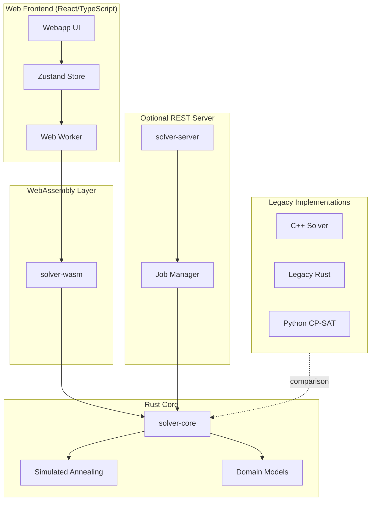
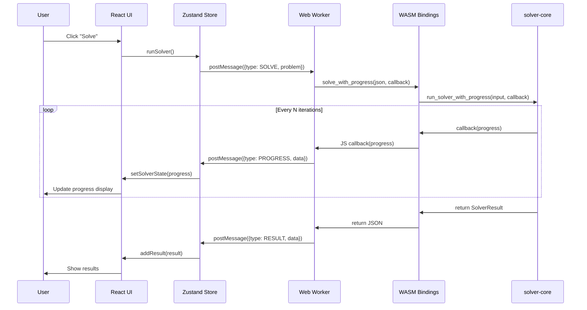
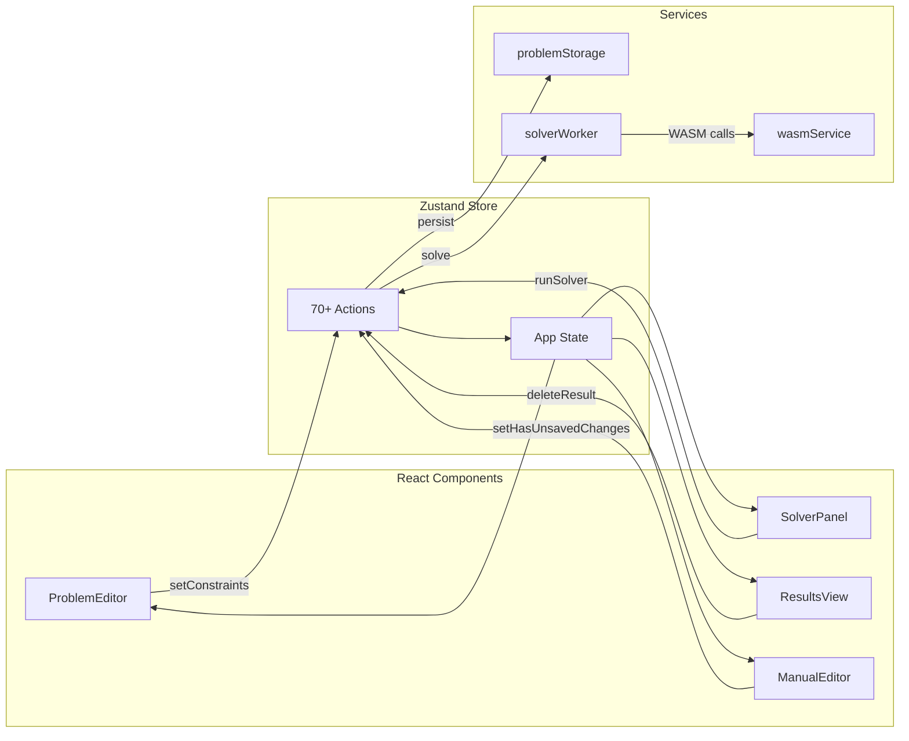

# Codebase Map

> Auto-generated by Cartographer. Last mapped: 2026-01-21

## System Overview

GroupMixer is a **group assignment optimization tool** that distributes people into groups across multiple sessions while maximizing social interactions and respecting constraints. Think: conference networking, team building, classroom seating rotations.



## Directory Structure

```
GroupMixer/
├── solver-core/              # Core Rust optimization library
│   ├── src/
│   │   ├── lib.rs           # Public API: run_solver(), recommended_settings
│   │   ├── models.rs        # All serializable types (ApiInput, Constraint, etc.)
│   │   ├── solver.rs        # State management, constraint processing (50k tokens)
│   │   └── algorithms/
│   │       ├── mod.rs       # Solver trait definition
│   │       └── simulated_annealing.rs  # SA implementation with dual moves
│   ├── examples/            # Integration demos
│   └── tests/               # Data-driven test suite with JSON cases
│
├── solver-wasm/             # WebAssembly bindings for browser use
│   └── src/lib.rs           # wasm-bindgen exports: solve(), validate(), etc.
│
├── solver-server/           # REST API server (optional)
│   └── src/
│       ├── main.rs          # Axum server entry point
│       ├── api/             # Routes and handlers
│       └── jobs/            # Async job management with DashMap
│
├── webapp/                  # React/TypeScript frontend
│   ├── src/
│   │   ├── App.tsx          # Router setup
│   │   ├── MainApp.tsx      # Main shell with header, nav, modals
│   │   ├── components/      # UI components (see detailed breakdown)
│   │   ├── services/        # WASM integration, storage, evaluation
│   │   ├── store/           # Zustand state management
│   │   ├── types/           # TypeScript definitions
│   │   ├── utils/           # Helpers (CSV export, theme, warm start)
│   │   ├── visualizations/  # Pluggable viz system (matrix, graph, 3D)
│   │   └── workers/         # Web Worker for off-thread solving
│   └── public/
│       ├── solver_wasm.*    # Compiled WASM files
│       └── test_cases/      # Sample problems
│
├── legacy_cpp/              # Original C++ implementation
├── legacy_rust/             # First Rust port (before major refactor)
├── python/                  # Google OR-Tools CP-SAT alternative
│
├── Cargo.toml               # Rust workspace definition
└── README.md                # Project documentation
```

## Module Guide

### solver-core (Core Library)

**Purpose**: Heart of the optimization engine - defines data models, implements simulated annealing, and provides the public API.

**Entry point**: `lib.rs` → `run_solver()` / `run_solver_with_progress()`

| File | Purpose | Tokens |
|------|---------|--------|
| `src/lib.rs` | Public API facade, recommended settings calculation | 6,297 |
| `src/models.rs` | All serializable types: ApiInput, Constraint enum, SolverResult | 8,574 |
| `src/solver.rs` | State class, constraint preprocessing, cost calculations | 50,158 |
| `src/algorithms/mod.rs` | Solver trait definition | 1,339 |
| `src/algorithms/simulated_annealing.rs` | SA with clique swaps, reheating, delta scoring | 12,283 |

**Key Exports**:
- `run_solver(api_input: ApiInput) -> SolverResult`
- `run_solver_with_progress(api_input, callback) -> SolverResult`
- `calculate_recommended_settings(api_input, runtime_seconds) -> SolverConfiguration`
- Types: `ApiInput`, `Person`, `Group`, `Constraint`, `SolverResult`, `ProgressUpdate`

**Dependencies**: serde, rand, thiserror, uuid, indicatif

**Patterns**:
- **Facade**: Simple public API hiding complex implementation
- **Strategy**: `Solver` trait allows pluggable algorithms
- **Union-Find (DSU)**: Merges overlapping clique constraints
- **Integer Indexing**: Converts string IDs to indices for O(1) operations
- **Incremental Scoring**: Delta calculations with periodic recalibration

---

### solver-wasm (WebAssembly Bindings)

**Purpose**: Exposes Rust solver to JavaScript via WebAssembly.

**Entry point**: `lib.rs`

| File | Purpose | Tokens |
|------|---------|--------|
| `src/lib.rs` | wasm-bindgen exports, JSON serialization, progress callback bridge | 3,068 |

**Key Exports**:
- `solve(problem_json: &str) -> String`
- `solve_with_progress(problem_json, callback) -> String`
- `validate_problem(problem_json) -> String`
- `get_default_settings() -> String`
- `get_recommended_settings(problem_json, runtime_seconds) -> String`
- `evaluate_input(input_json) -> String`

**Dependencies**: wasm-bindgen, js-sys, web-sys, console_error_panic_hook

**Gotchas**:
- All data transfer via JSON strings (no direct struct passing)
- Uses `unsafe { transmute }` to add `Send` to callbacks (safe in single-threaded WASM)
- Panic hook must be manually initialized

---

### solver-server (REST API)

**Purpose**: Optional HTTP server for server-side solving (not used by webapp).

**Entry point**: `main.rs` → `127.0.0.1:3000`

| File | Purpose | Tokens |
|------|---------|--------|
| `src/main.rs` | Axum server setup | 162 |
| `src/api/routes.rs` | Route definitions | 118 |
| `src/api/handlers.rs` | Request handlers, AppState | 365 |
| `src/jobs/manager.rs` | Async job execution with DashMap | 415 |

**Routes**:
- `POST /api/v1/jobs` - Create solver job
- `GET /api/v1/jobs/:id/status` - Get job status
- `GET /api/v1/jobs/:id/result` - Get job result

**Dependencies**: tokio, axum, dashmap, uuid

**Gotchas**:
- No auth, no TLS, development-only localhost binding
- Jobs stored in memory indefinitely (no cleanup)
- No cancellation support

---

### webapp (React Frontend)

**Purpose**: Full-featured web UI for problem definition, solving, result visualization, and manual editing.

**Entry points**:
- `main.tsx` → `App.tsx` (router) → `MainApp.tsx` (shell)

#### Core Components

| File | Purpose | Tokens |
|------|---------|--------|
| `components/ProblemEditor.tsx` | Define people, groups, sessions, constraints | 34,263 |
| `components/SolverPanel.tsx` | Solver controls, progress display, settings | 19,235 |
| `components/ResultsView.tsx` | Display metrics, compliance, assignments | 6,434 |
| `components/ManualEditor.tsx` | Drag-and-drop schedule editing with live eval | 11,476 |
| `components/ResultsHistory.tsx` | Result list, comparison, export | 8,053 |
| `components/LandingPage.tsx` | Marketing landing page | 6,888 |

#### Constraints UI

| File | Purpose | Tokens |
|------|---------|--------|
| `components/constraints/HardConstraintsPanel.tsx` | Immovable, MustStayTogether | 3,969 |
| `components/constraints/SoftConstraintsPanel.tsx` | RepeatEncounter, ShouldStayTogether, etc. | 4,349 |
| `components/modals/*.tsx` | Modal dialogs for constraint editing | ~15,000 |

#### Services

| File | Purpose | Tokens |
|------|---------|--------|
| `services/wasm.ts` | WASM singleton, format conversion | 3,565 |
| `services/solverWorker.ts` | Web Worker wrapper for off-thread solving | 4,181 |
| `services/evaluator.ts` | Client-side constraint evaluation | 3,226 |
| `services/problemStorage.ts` | LocalStorage persistence, snapshots | 3,563 |

#### State Management

| File | Purpose | Tokens |
|------|---------|--------|
| `store/index.ts` | Zustand store with 70+ actions | 9,742 |
| `store/theme.ts` | Theme management (light/dark/system) | 634 |

#### Visualizations

| File | Purpose | Tokens |
|------|---------|--------|
| `visualizations/registry.ts` | Plugin registration | 323 |
| `visualizations/plugins/scheduleMatrix/` | Grid view | 1,932 |
| `visualizations/plugins/contactGraph/` | Network graph (Sigma.js) | 8,780 |
| `visualizations/plugins/animated3D/` | Three.js 3D animation | ~20,000 |

**Dependencies**: React, React Router, Zustand, Vite, Tailwind, Three.js, Sigma.js, Lucide icons

**Patterns**:
- **Centralized State**: Zustand store manages all app state
- **Worker Offloading**: WASM runs in Web Worker to keep UI responsive
- **Problem Snapshots**: Each result captures the exact problem config used
- **Plugin Architecture**: Visualizations are pluggable with capabilities

---

### Legacy Implementations

| Directory | Purpose | Key Difference |
|-----------|---------|----------------|
| `legacy_cpp/` | Original C++ solver | Hardcoded gender binary, separate male/female tracking |
| `legacy_rust/` | First Rust port | Unified person model, multi-objective weights |
| `python/` | Google OR-Tools CP-SAT | Exact optimization (not heuristic), much slower |

---

## Data Flow

### Solving Flow



### State Management Flow



---

## Constraint System

### Hard Constraints (Must Satisfy)

| Constraint | Description | Behavior |
|------------|-------------|----------|
| `ImmovablePerson` | Person fixed to specific group(s)/session(s) | Never moved during optimization |
| `ImmovablePeople` | Multiple people fixed | Propagates through cliques |
| `MustStayTogether` | People must be in same group | Merged via Union-Find into cliques |
| Group Capacity | Max people per group | Enforced during initialization |

### Soft Constraints (Penalty-Based)

| Constraint | Description | Penalty |
|------------|-------------|---------|
| `RepeatEncounter` | Limits repeated pairings | Linear or squared per excess meeting |
| `AttributeBalance` | Maintain attribute distributions | Squared deviation from targets |
| `ShouldStayTogether` | Preference to be together | Penalty when separated |
| `ShouldNotBeTogether` | Preference to be apart | Penalty when together |
| `PairMeetingCount` | Cross-session meeting targets | Linear penalty for deviation |

### Constraint Processing

1. **Validation**: Checks for contradictions (e.g., must + must-not together)
2. **Merging**: Overlapping `MustStayTogether` merged into larger cliques via Union-Find
3. **Session Filtering**: Constraints can apply to specific sessions only
4. **Participation Aware**: Only enforced when all involved people participate in session

---

## Optimization Algorithm

### Simulated Annealing

**Temperature Schedule** (Geometric Cooling):
```
T(i) = T_initial × (T_final / T_initial)^(i / max_iterations)
```

**Acceptance Criterion** (Metropolis):
```
if delta_cost < 0:
    accept  # Always accept improvements
else:
    accept with probability = exp(-delta_cost / temperature)
```

### Move Types

| Move | Description | Cost | When Used |
|------|-------------|------|-----------|
| **Clique Swap** | Swap entire clique with non-clique people | O(n × sessions) - full recalc | When cliques exist |
| **Person Transfer** | Move one person to different group | O(group_size) - delta calc | When groups not full |
| **Regular Swap** | Swap two individuals between groups | O(group_size) - delta calc | Default |

### Performance

| Problem Size | People | Sessions | Typical Runtime |
|--------------|--------|----------|-----------------|
| Small | 12 | 3 | < 1 second |
| Medium | 30 | 5 | 5-10 seconds |
| Large | 60 | 8 | 30-60 seconds |
| Enterprise | 100+ | 10+ | 2-5 minutes |

---

## Conventions

### Naming
- **Rust**: snake_case for functions/variables, PascalCase for types
- **TypeScript**: camelCase for functions/variables, PascalCase for types/components
- **Files**: kebab-case for multi-word (Rust), PascalCase for React components

### Patterns
- **ID Mapping**: String IDs in API, integer indices internally
- **JSON Serialization**: All cross-boundary data via serde JSON
- **Session Semantics**: `None` = all sessions, `Some([])` = no sessions
- **Weight Semantics**: High (1000+) = hard constraint, Low = soft

### Testing
- **solver-core**: Data-driven tests with JSON test cases
- **webapp**: Manual testing (no automated tests)

---

## Gotchas

### Critical

1. **Session Indexing**: 0-based internally, displayed as "session_0", "session_1"
2. **None Semantics**: Different meanings for different fields
   - `person.sessions: None` = participates in all sessions
   - `constraint.sessions: None` = applies to all sessions
3. **Immovable Propagation**: If one clique member is immovable, ALL become immovable
4. **Score Drift**: Incremental updates periodically recalibrated to prevent drift
5. **WASM Callback Safety**: Uses `unsafe transmute` for Send trait (safe only because WASM is single-threaded)

### Frontend

6. **Format Conversion**: WASM service flattens nested solver params before sending to Rust
7. **Problem Snapshots**: Results store the exact problem config used (not current state)
8. **Worker Cancellation**: Terminates entire worker and creates new instance
9. **Navigation Blocking**: Manual editor patches `history.pushState` to intercept navigation

### Algorithm

10. **Clique Swaps**: Expensive (full recalculation) but necessary for correctness
11. **Move Selection**: Three types with probability based on problem structure
12. **Reheating**: Optional cycles or no-improvement-based to escape local optima

---

## Navigation Guide

### To add a new constraint type:
1. `solver-core/src/models.rs` - Add variant to `Constraint` enum
2. `solver-core/src/solver.rs` - Add preprocessing and penalty calculation
3. `webapp/src/types/index.ts` - Add TypeScript type
4. `webapp/src/services/wasm.ts` - Add format conversion if needed
5. `webapp/src/components/constraints/*.tsx` - Add UI panel
6. `webapp/src/components/modals/*.tsx` - Add editing modal
7. `webapp/src/services/evaluator.ts` - Add client-side evaluation

### To add a new visualization:
1. Create `webapp/src/visualizations/plugins/<name>/` directory
2. Create main component implementing `VisualizationPlugin` interface
3. Register in `webapp/src/visualizations/registry.ts`

### To modify the optimization algorithm:
1. `solver-core/src/algorithms/` - Add new algorithm or modify SA
2. Implement `Solver` trait
3. Add solver_type string in `solver-core/src/lib.rs`

### To add a new API endpoint (server):
1. `solver-server/src/api/handlers.rs` - Add handler function
2. `solver-server/src/api/routes.rs` - Add route

### To debug constraint violations:
1. Enable `debug_validate_invariants: true` in SolverConfiguration
2. Set `DEBUG_ATTR_BALANCE=1` env var for attribute balance logging
3. Use `webapp/src/services/evaluator.ts` for client-side debugging
