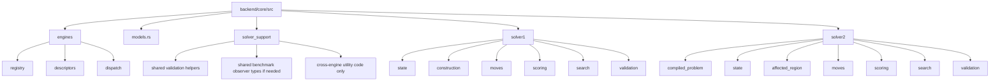

# Solver Engine Reshape Plan

## Status

Planned.

## Purpose

Prepare `gm-core` for a second solver architecture while keeping:

- the current solver in a **descriptive, dedicated directory**,
- the new solver in its own **descriptive, dedicated directory**,
- one shared engine registry and public contract surface,
- and one shared test + benchmark system.

This plan is about **getting the repo shape right before deeper implementation expands**.

It is intentionally aligned with:

- `docs/reference/principles/AGENTIC_ENGINEERING_PRINCIPLES.md`
- `docs/SECOND_SOLVER_READINESS_PLAN.md`
- `docs/MULTI_SOLVER_TARGET_ARCHITECTURE.md`
- `docs/BENCHMARKING_ARCHITECTURE.md`
- `docs/TESTING_STRATEGY.md`
- `docs/proposals/2026-04-02-solver-v2-architecture.md`

## Problem to solve now

The repo already has the beginnings of a multi-solver seam:

- typed `SolverKind`
- engine registry / dispatch
- solver-aware fixtures
- solver-aware benchmark artifacts

But the internal filesystem shape is still misleading:

- the current solver lives in generic directories like `solver/` and `algorithms/`
- the proposed new solver would otherwise land beside them with weaker boundaries
- benchmark reuse is possible, but the architecture should make that reuse intentional rather than accidental

The next step is to reshape the repo so that:

1. each solver family has a clear home
2. shared infrastructure is clearly separate from solver internals
3. benchmarks are reused through shared seams, not by copying legacy internals

## Naming decision

Avoid labels like:

- `legacy`
- `v2`
- `new`
- `old`

Avoid also forcing overly specific architectural claims into folder names when the real distinctions are still evolving.

In this case, the two solver families may share search-policy ideas such as simulated annealing while differing mainly in internal architecture and data flow. That makes many "descriptive" names brittle or misleading.

So the repo should use **neutral numbered family names** for the long-lived internal seam.

## Recommended canonical names

### Current solver family

**Directory:** `backend/core/src/solver1/`

**Canonical solver family id:** `solver1`

### Proposed new solver family

**Directory:** `backend/core/src/solver2/`

**Canonical solver family id:** `solver2`

## Why these names

### `solver1` / `solver2`
These names are intentionally neutral.

That is a feature here, not a weakness.

They avoid:

- chronology-laden labels like `legacy` and `v2`
- judgment words like `naive`
- misleading architectural claims in short path names
- ugly acronym soup that future contributors must decode

The descriptive truth should instead live in explicit metadata and docs, such as:

- `SolverKind`
- solver descriptors / notes
- benchmark artifact metadata
- architecture docs
- parity and rollout docs

This keeps source paths short and stable while preserving honest architectural description elsewhere.

## Compatibility rule

At the current public parse boundary, the repo should continue to accept the existing historical aliases for the current solver, including:

- `SimulatedAnnealing`
- `simulated_annealing`
- `legacy_simulated_annealing`

But internally, shared code should converge on the new canonical neutral id:

- `solver1`

This keeps migration explicit without breaking existing saved requests or wrappers immediately.

## Non-goals

This plan does **not** require, yet:

- exposing the new solver in normal webapp product flows
- forcing both engines to share internal state models
- forcing both engines to expose identical hotpath telemetry
- replacing the benchmark system
- rewriting all public contract surfaces in one PR
- changing solver semantics as part of the directory move alone

## Architectural rules

### 1. Dedicated directories per solver family
Each solver family gets one dedicated internal home.

No solver family should live in a generic catch-all directory once this reshape is complete.

### 2. Shared infrastructure stays shared
The following should remain outside solver-family directories:

- engine registry / dispatch
- public models and result types
- benchmark observer contracts
- cross-solver fixture harnesses
- benchmark suite runner and artifact/reporting code

### 3. Benchmark reuse through shared seams
The benchmark system must call into both engines through the same high-level seam.

It must **not** require:

- copied benchmark runners
- copied artifact schemas
- copied suite manifests
- copied comparison logic

### 4. Honest benchmark semantics
Shared benchmark infrastructure does not mean fake identical internals.

If the two engines differ structurally:

- solve-level suites should still be shared
- comparison categories should still be shared
- hotpath probes may diverge where needed
- artifacts must record solver family explicitly

### 5. No generic `solver/` as the home of one engine
A generic path like `backend/core/src/solver/` should not remain the home of only one concrete engine after this reshape.

That violates explicit boundaries.

## Target layout



## Concrete directory target

```text
backend/core/src/
  engines/
    mod.rs
  models.rs
  solver_support/
    mod.rs
    validation.rs         # only truly cross-engine helpers
    telemetry.rs          # only if shared observer glue is needed
  solver1/
    mod.rs
    state.rs
    construction.rs
    display.rs
    constraint_index.rs
    dsu.rs
    moves/
      mod.rs
      swap.rs
      transfer.rs
      clique_swap.rs
    scoring/
      mod.rs
    search/
      mod.rs
      simulated_annealing.rs
    validation.rs
  solver2/
    mod.rs
    compiled_problem.rs
    state.rs
    move_types.rs
    affected_region.rs
    moves/
      mod.rs
      swap.rs
      transfer.rs
      clique_swap.rs
    scoring/
      mod.rs
      contacts.rs
      pair_constraints.rs
      pair_meeting.rs
      attribute_balance.rs
      clique.rs
      immovable.rs
    search/
      mod.rs
      engine.rs
      candidate_generation.rs
      acceptance.rs
      reheating.rs
    validation/
      mod.rs
      parity.rs
      invariants.rs
```

## Benchmark reuse model

The new solver should reuse the existing benchmark system as a **consumer**, not by duplicating it.

## Reuse fully

These surfaces should remain shared for both engines:

- `backend/core/tests/data_driven_tests.rs`
- `backend/core/tests/property_tests.rs`
- `backend/benchmarking/` suite manifests
- benchmark artifact schemas
- baseline storage
- comparison reporting
- recordings/history/indexing
- `gm-cli benchmark ...` workflow

## Reuse with adaptation

These surfaces may need engine-specific additions while still living in the same benchmark system:

- hotpath benchmark modes
- move-family-specific path fixtures
- engine-specific benchmark telemetry extensions

The rule is:

- **one benchmark platform**
- **possibly different probes per engine where the architecture truly differs**

## Shared benchmark contract each engine must satisfy

Each engine should plug into the benchmark system by satisfying this shared minimum contract:

1. selectable via `SolverKind`
2. discoverable through the engine registry / descriptors
3. runnable through the shared solve entrypoint
4. returns the normal shared `SolverResult`
5. emits shared benchmark telemetry truthfully
6. records its canonical solver family id in benchmark artifacts
7. participates in explicit comparison categories

## What the new solver should not be forced to do for benchmark reuse

The new solver should **not** be forced to:

- reuse the current solver's `State`
- reuse the current solver's move cache layout
- pretend its internal hotpath breakdown is identical
- emit fake `swap/transfer/clique_swap` timing buckets if those cease to be the truthful internal units

If `solver2` still uses comparable move families, reuse those categories.
If not, extend the benchmark system honestly rather than bending the new engine to match the old one.

## Phased plan

## Phase 0 — Naming and seam freeze

### Goal
Lock descriptive names and the target directory shape before implementation starts spreading.

### Deliverables

- this plan
- agreed canonical solver family ids
- agreed directory names
- agreed compatibility alias policy for the current solver

### Acceptance

- no new docs or code should introduce `legacy` / `v2` naming for the solver-family seam
- `solver1` / `solver2` are the accepted neutral family names for source layout and canonical internal ids

## Phase 1 — Pure directory reshape for the current solver

### Goal
Move the current solver into a descriptive dedicated directory without changing behavior.

### Work

- move `backend/core/src/solver/` into `backend/core/src/solver1/`
- move or absorb `backend/core/src/algorithms/simulated_annealing.rs` into that solver-family tree
- update `lib.rs`, `engines/`, and imports
- keep behavior unchanged
- keep existing tests and benchmark flows green

### Important rule
This phase is a **mechanical boundary cleanup**, not a semantic rewrite.

### Acceptance

- current solver internals no longer live in generic `solver/` and `algorithms/` paths
- all existing tests pass unchanged in behavior
- benchmark commands still run against the current solver

## Phase 2 — Strengthen canonical solver-family identifiers

### Goal
Align internal solver-family ids with the new canonical neutral naming.

### Work

- extend `SolverKind` with the neutral canonical ids
- keep parse aliases for older ids
- update engine descriptors
- update benchmark artifact metadata to record the canonical neutral id
- update fixture parsing and benchmark manifest parsing to accept old aliases but normalize to new ids

### Acceptance

- internal code and benchmark artifacts use the canonical ids `solver1` / `solver2`
- public parse boundaries still accept historical aliases where required
- no silent fallback between solver families exists

## Phase 3 — Separate shared infrastructure from solver-family internals

### Goal
Make it obvious which code is shared and which code belongs to one engine.

### Work

- create `solver_support/` only for truly cross-engine helpers
- keep engine registry in `engines/`
- avoid leaking current-solver-only helpers into shared directories
- review imports so shared code does not accidentally depend on `solver1` internals except through the engine seam

### Acceptance

- shared code is small and explicit
- current solver internals are no longer the accidental global default
- adding the new solver does not require touching unrelated current-solver internals by default

## Phase 4 — Bootstrap `solver2`

### Goal
Create the new solver-family directory and compile it behind the shared engine seam.

### Work

- add `backend/core/src/solver2/`
- add a new `SolverKind` variant and descriptor
- implement explicit unsupported behavior where parts are not ready yet
- start with correctness-first skeletons:
  - `CompiledProblem`
  - `SolutionState`
  - full recomputation path
  - validation/parity scaffolding

### Acceptance

- the new solver family is discoverable through the registry
- it has its own dedicated directory
- it can fail explicitly for unimplemented operations instead of silently routing to the current solver

## Phase 5 — Attach the new solver to the existing test harness

### Goal
Reuse the existing solver-aware test stack immediately.

### Work

- run `solver2` through property/invariant tests where possible
- add solver-aware data-driven fixtures using explicit comparison categories
- start with:
  - `invariant_only`
  - then `bounded_parity`
  - then `score_quality`
- add parity tests between current and new solver where honest

### Acceptance

- no duplicated fixture harness exists
- both engines run through the same high-level test machinery
- comparison categories are explicit per fixture/suite

## Phase 6 — Attach the new solver to the existing benchmark system

### Goal
Reuse the benchmark system without cloning it.

### Work

- run solve-level suites for `solver2`
- store solver-family identity in the existing artifact shape
- reuse existing baseline / compare / recording flow
- add new hotpath modes only where the architecture actually needs them

### Acceptance

- one benchmark platform produces artifacts for both solver families
- cross-solver solve-level comparisons work through the existing tooling
- no separate benchmark crate or parallel reporting system is introduced

## Phase 7 — Only later: UI/runtime/product exposure

### Goal
Keep the architectural cleanup separate from product exposure.

### Work later

- webapp capability-driven solver selector
- solver-specific settings metadata
- explicit unsupported-mode behavior in UI flows
- contract/runtime selection cleanup

### Rule
Do not make the new solver user-selectable in normal product flows until the rollout criteria in `docs/MULTI_SOLVER_ROLLOUT_CRITERIA.md` are satisfied.

## PR sequence recommendation

## PR 1 — current solver directory reshape
Mechanical move only.

## PR 2 — canonical ids + alias normalization
No new solver implementation yet.

## PR 3 — shared/support boundary cleanup
Keep shared vs solver-family code honest.

## PR 4 — `solver2` skeleton + registry integration
Explicit unsupported behavior allowed.

## PR 5 — parity/invariant harness integration
Use existing test surfaces.

## PR 6 — solve-level benchmark integration
Reuse existing benchmark platform.

## PR 7+ — incremental implementation of move families and search layers
Benchmark and parity evidence required at each stage.

## Risks

### Risk 1 — descriptive names become inaccurate
Mitigation:
- choose names tied to current architectural truth
- rename before broad exposure if reality changes materially

### Risk 2 — shared directories become a dumping ground
Mitigation:
- keep `solver_support/` minimal
- reject solver-family-specific logic there during review

### Risk 3 — benchmark reuse pressures fake internal sameness
Mitigation:
- share solve-level benchmark infrastructure
- allow honest hotpath divergence where necessary
- keep comparison categories explicit

### Risk 4 — directory move and semantic refactor get mixed together
Mitigation:
- keep Phase 1 mechanical
- require green tests/benchmarks before starting deeper architecture work

## Definition of done for the reshape

The repo is in the right shape for sustained parallel solver work when all of the following are true:

1. the current solver lives in `solver1/`
2. the new architecture lives in `solver2/`
3. shared engine dispatch lives outside both directories
4. generic `solver/` is no longer the home of one concrete engine
5. canonical neutral solver family ids are in place internally
6. old ids remain accepted only as explicit parse aliases where needed
7. both engines can plug into the same fixture harness
8. both engines can plug into the same solve-level benchmark system
9. benchmark artifact/reporting infrastructure is not duplicated
10. unsupported behavior remains explicit rather than silently routed to the current solver

## Immediate next action

Start with **PR 1: current solver directory reshape**.

That gives the repo honest boundaries first, keeps the current solver intact, and clears the path for `solver2` to reuse the existing verification and benchmark stack without architectural confusion.
