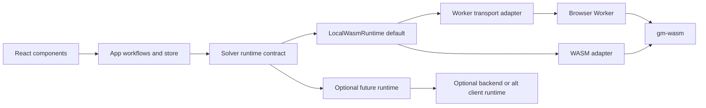
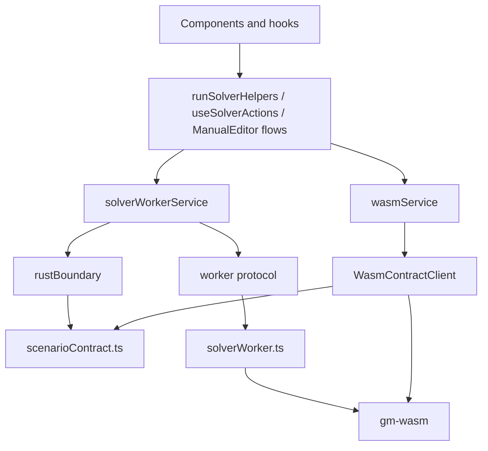
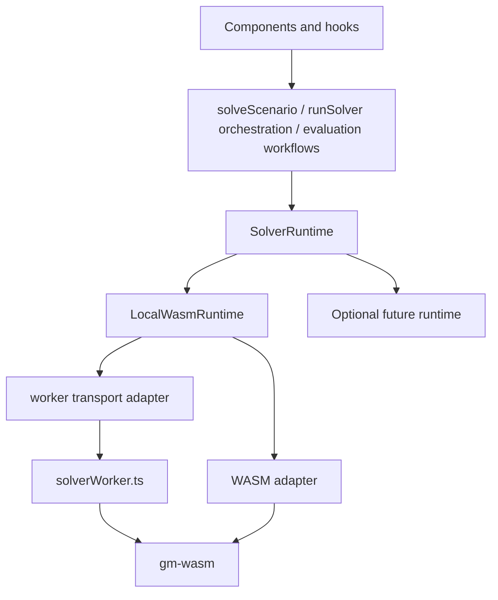
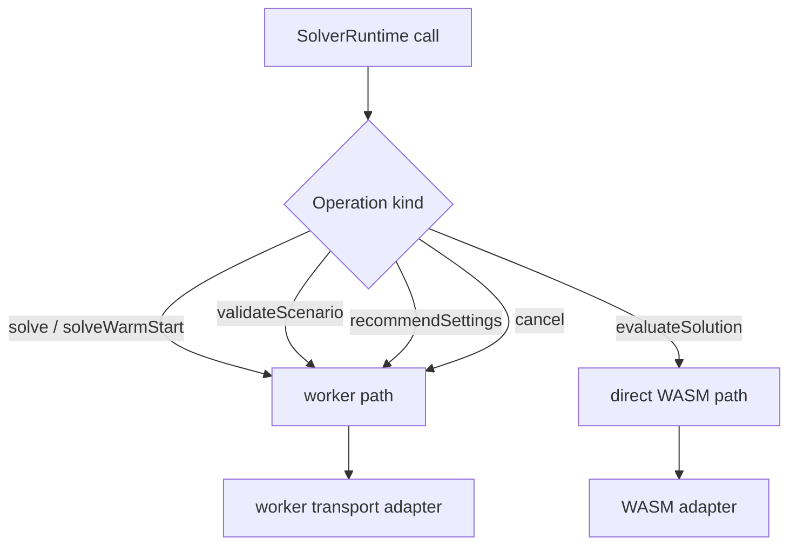

# Solver Runtime Target Architecture

## Purpose

Define the target architecture for decoupling the GroupMixer frontend from solver implementation details **without changing the core execution principle**:

- solving remains **client-side by default**
- the primary runtime remains **browser-side WASM**
- backend solving remains **optional**
- future solver implementations should plug in with minimal UI churn

This is a **semantic decoupling** plan, not a client-to-server migration plan.

Important framing:

- this runtime boundary is an **app-internal execution boundary** for the webapp
- it does **not** replace `gm-contracts` as the repo's public semantic source of truth
- the first target is a clean local-runtime seam that still leaves room for future remote or async runtimes

## Non-goals

- moving default solve execution from browser to server
- replacing `gm-wasm` as the main runtime
- rewriting the store or UI architecture wholesale
- introducing backend job orchestration as a prerequisite
- redesigning solver progress/state semantics beyond what the migration needs
- pushing protobuf into React/store boundaries

## Problem statement

Today the webapp has usable abstractions, but app-facing code is still too shaped around:

- WASM-specific contract payloads
- worker-specific transport semantics
- Rust-boundary terminology
- local execution assumptions

That coupling makes it harder to:

- add another solver implementation
- add another runtime transport
- compare local WASM vs alternative runtimes
- keep UI code independent from execution mechanics

## Architectural goal

The webapp should depend on a **solver runtime contract**, not directly on:

- `solverWorkerService`
- WASM module APIs
- worker message protocol types
- raw Rust-boundary conversion details

The intended boundary is:

```text
UI / store / app workflows
        ↓
solver runtime contract
        ↓
concrete runtime adapter
        ↓
implementation-specific transport + conversion
        ↓
solver engine
```

## Relationship to the repo's public contracts

GroupMixer already has a repo-level public contract direction through `gm-contracts` and the contract-native CLI/API/WASM surfaces.

This frontend runtime layer should therefore be treated as:

- an app-facing execution boundary
- a way to hide local transport and implementation details from React/store code
- a consumer/projection of deeper solver semantics where relevant

It should **not** become:

- a second competing semantic registry
- a conflicting public error/schema source of truth
- a browser-only redefinition of the solver surface that drifts from repo-wide contracts

## The important reality: LocalWasmRuntime has two execution paths

The local runtime is not one execution path today. It is two:

| Path | Current implementation | Typical use | Threading |
|---|---|---|---|
| Worker path | `SolverWorkerService` | solve, recommend settings, validate, cancel | off main thread |
| Direct WASM path | `WasmService` / `WasmContractClient` | solution evaluation hot paths | main thread |

The runtime architecture must acknowledge this explicitly.

## Target dependency structure



## Current vs target shape

### Current shape



### Target shape



## Execution routing inside `LocalWasmRuntime`

`LocalWasmRuntime` should own the routing decision between the two local execution paths.



### Required routing policy

#### Worker path
Use the worker path for:

- `solve()` / `solveWithProgress()`
- `solveWarmStart()`
- `validateScenario()`
- `recommendSettings()`
- `cancel()`

Reason:
- avoids blocking the main thread
- preserves current solve/cancel behavior
- preserves current latency profile for heavy work

#### Direct WASM path
Use the direct WASM path for:

- `evaluateSolution()` hot paths used by Manual Editor and save-best-so-far evaluation

Reason:
- these flows are latency-sensitive
- they already rely on direct synchronous WASM evaluation semantics
- moving them to the worker would change UX and tuning behavior

## Design principles

### 1. WASM-first remains the default
The main execution model remains:

- browser
- worker for heavy solve path
- WASM as the engine

### 2. App-facing contracts must be runtime-neutral
App code should deal in concepts like:

- scenario validation
- recommended settings
- solve progress
- solve result
- cancellation
- snapshot evaluation

not in terms like:

- raw WASM payloads
- worker envelopes
- raw Rust result JSON
- transport-specific message types

### 3. One semantic runtime interface
The UI should depend on one runtime interface, even though the local implementation internally routes to two execution paths.

### 4. The runtime contract must keep capabilities explicit
Not every future runtime must expose identical behavior.

The runtime layer should surface capability differences explicitly rather than hiding them.

Examples:
- streaming progress available vs unavailable
- direct evaluation available vs unavailable
- warm start available vs unavailable
- active local solve inspection / best-snapshot access available vs unavailable
- local convenience solve vs async run-oriented lifecycle

### 5. Keep conversion logic at the edge
Conversions between app/domain types and implementation-specific payloads belong in adapter layers, not components.

### 6. Keep normalization at the contract-adapter edge
Normalization should stay at the adapter edge, but it should be classified honestly.

Some normalization is best thought of as:

- browser app model → solver contract input preparation

rather than purely as a WASM-only transport quirk.

Important example:
- `normalizeScenarioForWasm()` should not remain a freestanding app utility, but its responsibilities are closer to solver-contract input preparation than to purely low-level transport mechanics.
- if a future HTTP/backend runtime needs the same public input semantics, this logic should be reusable rather than duplicated.

### 7. Be honest about progress shape for this migration
For this migration, the runtime progress type should be a **near-alias** of the current `ProgressUpdate` shape.

That means:
- no large progress remodel yet
- no fake abstraction claiming the progress model is solver-independent when it is still Rust-defined
- app code still gets a stable runtime type owned by the runtime layer

It also means:
- do not claim that every future runtime must expose the same full simulated-annealing-heavy telemetry shape
- treat the current shape as honest local-runtime telemetry, not as the final universal runtime truth

A deeper semantic progress remodel can happen later as a separate project.

### 8. Local convenience APIs must not be mistaken for the final universal lifecycle model
For this migration it is fine if the app-facing runtime exposes direct local-style methods such as:

- `solve()`
- `solveWithProgress()`
- `solveWarmStart()`
- `cancel()`

But these should be understood as a local-first convenience surface.

If GroupMixer later adds server-authoritative or async runtimes, it may need an additional run-oriented lifecycle surface with run IDs, inspection, and run-scoped cancellation.

### 9. Active local solve state must be explicit
The current browser runtime has workflows that depend on the existence of an *active solve*, not just a completed solve result.

Examples:

- cancel current solve
- save best-so-far while the solve is still running
- resume from the current best schedule after save/cancel coordination
- inspect the latest progress / best-schedule snapshot

Today those workflows are effectively coupled to implicit singleton state in `solverWorkerService`.

The target architecture should make that state explicit at the runtime boundary.

For this migration, the recommended shape is:

- keep simple local-first methods such as `solveWithProgress()` and `cancel()`
- let `LocalWasmRuntime` own explicit active local solve coordination/state behind them
- expose any app-needed active-solve inspection through a runtime-owned, capability-gated surface rather than through leaked worker-service internals

This is intentionally not yet a universal remote job model.

But it must also not remain a thin wrapper around hidden `solverWorkerService.getLastProgressUpdate()` state.

### 10. Recommendation fallback policy must stay explicit
`recommendSettings()` at the runtime boundary should either:

- return normalized recommended settings, or
- fail with a runtime-owned error

If the UI wants a fallback such as continuing with the current settings, that should remain explicit caller policy.

The runtime layer should not silently convert recommendation failure into “use the existing settings” as if that were semantically equivalent.

## Proposed frontend module layout

```text
webapp/src/services/
  runtime/
    types.ts                # runtime-owned semantic types
    runtime.ts              # SolverRuntime interface + cancel semantics
    localWasmRuntime.ts     # current primary implementation
    index.ts                # getRuntime()
    contractTests.ts        # shared runtime contract test helpers

  runtimeAdapters/
    wasm/
      workerTransport.ts    # wraps worker lifecycle/message transport
      wasmAdapter.ts        # wraps WasmContractClient and input normalization
      conversions.ts        # edge conversions only

  solver/
    solveScenario.ts        # app-facing orchestration using SolverRuntime
```

Use a simple `getRuntime()` for now. A more elaborate selector/registry is unnecessary until there is a second real runtime.

If a future HTTP/backend runtime appears, shared browser-app → solver-contract normalization may be factored into reusable adapter code rather than duplicated as a WASM-only concern.

The same simplicity rule applies to active solve coordination:

- do not build a premature universal run registry now
- but do define one explicit runtime-owned place for local active solve state to live

## Runtime boundary responsibilities

### App / workflow layer
Owns:

- user intent
- sequencing of solve flows
- selection of recommended vs manual settings
- save-best-so-far behavior
- UI/store updates
- result persistence orchestration

Must not own:

- worker message schemas
- WASM payload building
- raw result parsing details
- transport-specific cancellation mechanics

### Solver runtime contract
Owns:

- stable semantic operations used by the app
- runtime capability reporting
- runtime-owned progress/result/error types
- runtime-level cancel semantics

Must not own:

- React/store concerns
- raw transport mechanics
- gm-wasm-specific DTOs
- a second competing public semantic registry that drifts from `gm-contracts`

### `LocalWasmRuntime`
Owns:

- routing between worker path and direct WASM path
- normalization of recommended settings before returning them
- conversion of implementation-specific errors into runtime errors
- hiding worker restart/reinit behavior after cancellation
- maintaining explicit active local solve coordination/state needed for cancel/save/resume workflows
- enough local active-run coordination to support current cancel/save/resume behavior without leaking worker details back into components

### WASM adapter
Owns:

- preparing solver-contract input payloads for local WASM execution
- parsing WASM output payloads
- scenario normalization/preparation used by the local browser runtime
- wrapping `WasmContractClient`

Important example responsibilities currently represented by `scenarioContract.ts`:

- objective defaults injection
- constraint normalization
- solver settings sanitization
- deep-clone / payload-safe transformation

### Worker transport adapter
Owns:

- worker lifecycle
- message transport
- progress event forwarding
- worker cancellation/reinitialization behavior
- access to last progress snapshot if still needed internally by `LocalWasmRuntime`

Must not become the app-facing owner of active solve state.

## Runtime contract semantics

### Suggested operations
- `initialize()`
- `getCapabilities()`
- `validateScenario()`
- `recommendSettings()`
- `solve()` / `solveWithProgress()`
- `solveWarmStart()`
- `evaluateSolution()`
- `cancel()`

If the app needs active local solve inspection for save-best-so-far and resume, add a small explicit runtime-owned surface for that purpose, for example:

- `getActiveSolveSnapshot()`
- `hasActiveSolveSnapshot()`

or an equivalent solve-handle-based shape.

These are appropriate for the current local-first migration.

They should not be misread as proof that every future runtime must be synchronous, callback-driven, or globally cancellable without a run ID.

If a future runtime becomes async/job-oriented, add run-oriented lifecycle operations deliberately rather than forcing fake parity.

### Active local solve semantics
For the current local-first architecture, it is acceptable for active solve inspection to be scoped to “the current local active solve”.

But that scope must be explicit.

Recommended rules:

- save-best-so-far and resume must consume runtime-owned active solve state
- app code must not read `solverWorkerService.getLastProgressUpdate()` directly
- if a runtime does not support active solve inspection, that absence should be visible through capabilities or explicit method unavailability

This keeps the local runtime honest without pretending the current singleton-flavored model is the final universal lifecycle design.

### Cancel semantics

Cancel semantics should be explicit at the runtime interface.

Recommended contract for this migration:

- active solve operations reject with a **typed cancellation error** owned by the runtime layer
- callers do not inspect string messages like `"cancelled"`
- callers do not know that current cancellation means worker termination + reinitialization
- `cancel()` itself resolves when the runtime has completed its cancellation procedure

Important caveat:

- `cancel()` is acceptable as the current local-runtime convenience shape
- future remote or job-oriented runtimes may need run-scoped cancellation instead

This keeps transport details hidden while preserving the current behavior model.

### Recommended settings semantics

`recommendSettings()` should return **already-normalized** settings.

That means normalization currently handled by `normalizeRecommendedSolverSettings()` should move behind the runtime adapter rather than remaining duplicated at call sites.

If recommendation lookup later needs fallback behavior, that fallback should be surfaced explicitly rather than hidden silently behind the runtime boundary.

## Suggested semantic types

### Input-side concepts
- `ScenarioInput`
- `WarmStartInput`
- `RecommendedSettingsRequest`
- `SolveRequest`

### Output-side concepts
- `RuntimeCapabilities`
- `ValidationResult`
- `RecommendedSettingsResult`
- `SolveProgressEvent`
- `SolveRunResult`
- `EvaluationResult`
- `RuntimeError`
- `RuntimeCancelledError`

For this migration, `SolveProgressEvent` should stay very close to the current `ProgressUpdate` shape.

If future async runtimes are added, introduce separate run-oriented concepts such as run handles, run status, or run inspection types deliberately rather than overloading the local convenience result shape.

## Runtime contract tests

The runtime abstraction should come with shared contract tests.

Split the suite into:

### Core required suite
- initialization
- capabilities
- validation
- recommended settings normalization
- solve success
- error normalization

### Capability-specific suites
- warm-start solve
- cancellation semantics
- evaluation semantics
- streaming progress semantics

Any runtime implementation should be expected to pass the core suite plus the capability-specific suites for the capabilities it claims.

This is one of the most important architecture guardrails in the plan.

## File-level mapping from current code

### Current implementation-heavy files
- `webapp/src/services/solverWorker.ts`
- `webapp/src/services/wasm.ts`
- `webapp/src/services/rustBoundary.ts`
- `webapp/src/workers/solverWorker.ts`
- `webapp/src/services/solver/solveScenario.ts`
- `webapp/src/services/wasm/scenarioContract.ts`

### Current orchestration hotspot to decompose first
- `webapp/src/components/SolverPanel/utils/runSolver.ts`

### App-facing integration points to decouple
- `webapp/src/components/SolverPanel/hooks/useSolverActions.ts`
- `webapp/src/components/SolverPanel/utils/runSolverHelpers.ts`
- `webapp/src/components/SolverPanel/utils/saveBestSoFar.ts`
- `webapp/src/components/ManualEditor/dropPipeline.ts`
- `webapp/src/components/ManualEditor/hooks/useManualEditorEvaluation.ts`

## Acceptance criteria for the target architecture

The architecture is achieved when all of the following are true:

1. app-facing code does not import raw worker protocol types
2. app-facing code does not import WASM module contract types
3. `solverWorkerService` becomes an internal dependency of `LocalWasmRuntime`, not a broadly used app service
4. direct WASM evaluation remains available through the runtime for hot paths
5. `normalizeScenarioForWasm()` is clearly treated as adapter-edge solver-contract preparation logic, not a freestanding app concern
6. `recommendSettings()` returns normalized settings from the runtime boundary
7. save-best-so-far and resume consume runtime-owned active solve state rather than leaked worker singleton state
8. cancellation is represented through runtime-owned semantics, not string matching
9. runtime capabilities are explicit rather than implicit
10. adding a second runtime does not require component/store rewrites or fake local-only parity
11. local browser-side WASM solving remains the default and fully supported path

## Future considerations

If GroupMixer later moves toward server-authoritative solving with async jobs, stable run IDs, and inspect surfaces, add that as a deliberate run-oriented lifecycle layer rather than stretching the local-first convenience API until it lies.

When that happens, the local active-solve surface introduced here should either:

- evolve into explicit run handles, or
- stay clearly local-only behind capability-gated methods

It should not become an accidental fake universal job model.

If GroupMixer later experiments with solver implementations in other languages, introduce a **separate cross-language solver protocol**. Protobuf is a good candidate there.

Use protobuf for:
- cross-language solver request/response envelopes
- progress/result/error protocol contracts
- optional remote or orchestrated solver backends

Do **not** use protobuf as the main React/store boundary.

## Migration strategy summary

Recommended strategy:

1. decompose `runSolver.ts` first
2. introduce runtime boundary with explicit types and contract tests
3. route app-facing workflows through the runtime contract
4. move WASM/worker specifics behind `LocalWasmRuntime`
5. only then add optional new runtimes

That keeps the codebase controlled and avoids mixing architectural cleanup with runtime expansion.
